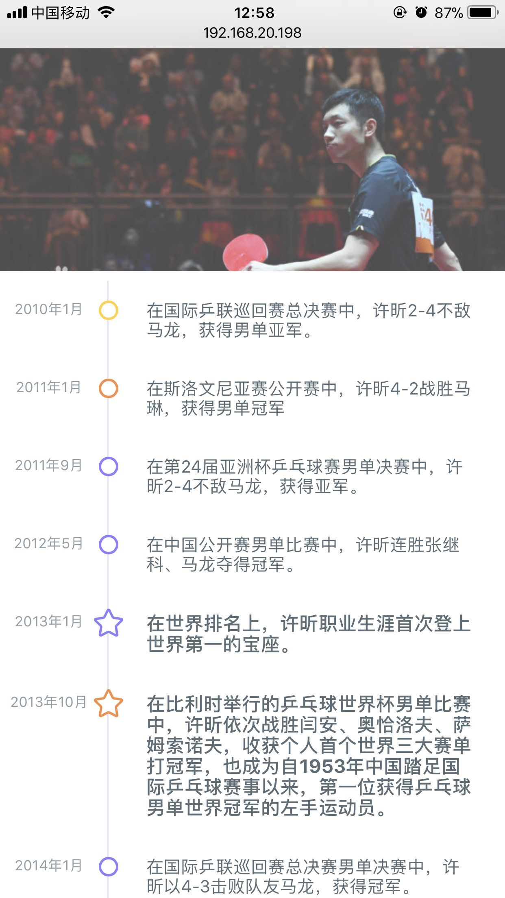
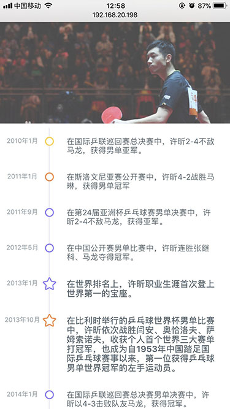
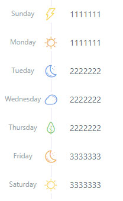

## vue-light-timeline

A lightweight timeline components for vue2


## install

```shell
yarn add vue-light-timeline
```

if you prefer npm:

```shell
npm i vue-light-timeline
```

## usage

```js
import Vue from 'vue';
import LightTimeline from 'vue-light-timeline';

Vue.use(LightTimeline);
```

```html
<template>
  <light-timeline :items='items'></light-timeline>
</template>
<script>
const theme = 'red';
export default {
  data () {
    return {
      items: [
        {
          tag: '2018-01-12',
          content: 'hallo'
        },
        {
          tag: '2018-01-13',
          color: '#dcdcdc',
          type: 'circle',
          content: 'world'
        },
        {
          type: 'star',
          tag: '2018-01-14',
          htmlMode: true,
          content: `<div style="color: ${theme};"> =v = </div>`
        }
      ]
    }
  }
}
</script>
```
- slot

Or you can pass slots for each part of the timeline:

```html
<template>
  <light-timeline :items='items'>
    <template slot='tag' slot-scope='{ item }'>
      {{item.date}}
    </template>
    <template slot='symbol' slot-scope='{ item }'>
      <div class="my_icon_class"><i :class="item.class"></i><div>
    </template>
    <template slot='content' slot-scope='{ item }'>
      {{item.content}}
    </template>
  </light-timeline>
</template>
<script>
export default {
  data () {
    return {
      items: [
        {
          tag: '2018-01-12',
          content: 'hallo',
          class: 'fas fa-star'
        },
        {
          tag: '2018-01-13',
          content: 'world',
          class: 'far fa-star'
        },
        {
          tag: '2018-01-14',
          content: 'other',
          class: 'fas fa-star'
        }
      ]
    }
  }
}
</script>
```
here is [example demo](https://sme-fe.github.io/vue-light-timeline/#/slot) and [code](https://github.com/SME-FE/vue-light-timeline/blob/master/example/components/Slot.vue)

## Demo

[https://sme-fe.github.io/vue-light-timeline/#/](https://sme-fe.github.io/vue-light-timeline/#/)

Hei, let's gonna try it online, have fun ~~

[](https://codesandbox.io/s/yvrml426vx)

### demo screenshot

<!--  -->



## docs

### Attributes

Attribute | Description | Type | Accepted values	 | Default
----|------|----|----|----
items | timeline content data  | Array | -- | --

### items

Attribute | Description | Type | Accepted values	 | Default
----|------|----|----|----
tag | item tag | String | -- | --
content | item content | String | -- | --
htmlMode | output real HTML as content | Boolean | -- | false
type | point type | String | circle, star | circle
color | point color | String | purple,orange,yellow,or hex colors RGB colors so on... | purple

### slot

- tag: slot='tag' replace the default tag
- symbol: slot='symbol' replace the default icon
- content: slot='content' replace the default tag

### Attributes

参数 | 说明 | 类型 | 可选值	 | 默认值
----|------|----|----|----
items | timeline 需要展示的数据  | Array | -- | --

### items

参数 | 说明 | 类型 | 可选值	 | 默认值
----|------|----|----|----
tag | item 标签（可选） | String | -- | --
content | item 内容 | String | -- | --
htmlMode | 是否HTML字串 | Boolean | -- | false
type | point 类型 | String | circle, star | circle
color | point 颜色 | String | purple,orange,yellow,or hex colors RGB colors so on... | purple

### slot 插槽

- tag: slot='tag' 替换原先的标签
- symbol: slot='symbol' 替换原先的图标
- content: slot='content' 替换原先的内容

## Contributors

Thanks goes to these wonderful people ([emoji key](https://github.com/kentcdodds/all-contributors#emoji-key)):

<!-- ALL-CONTRIBUTORS-LIST:START - Do not remove or modify this section -->
| [<br /><sub>hwen</sub>](https://github.com/hwen)<br />[🤔](#ideas "Ideas & Planning") [💻](https://github.com/SME-FE/vue-light-timeline/commits?author=hwen "Code") [🎨](#design "Design") [📖](https://github.com/SME-FE/vue-light-timeline/commits?author=hwen "Documentation") [💡](#example "Examples") | [<br /><sub>luyilin</sub>](https://github.com/luyilin)<br />[🤔](#ideas "Ideas & Planning") [💻](https://github.com/SME-FE/vue-light-timeline/commits?author=luyilin "Code") |
| :---: | :---: |

<!-- ALL-CONTRIBUTORS-LIST:END -->

This project follows the [all-contributors][all-contributors] specification.
Contributions of any kind are welcome!
## License

[MIT License](https://opensource.org/licenses/MIT)

Copyright (c) 2017-present, hwen <hwenleung@gmail.com>
